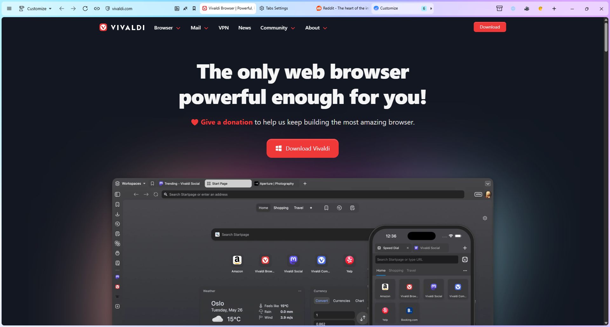
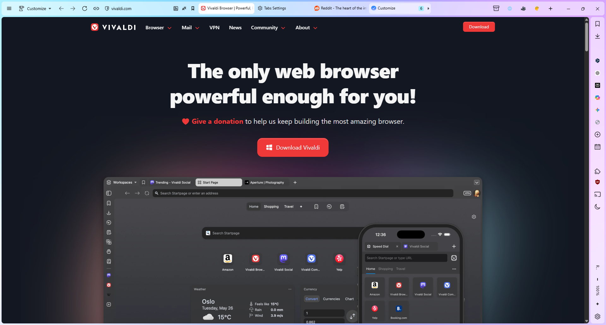
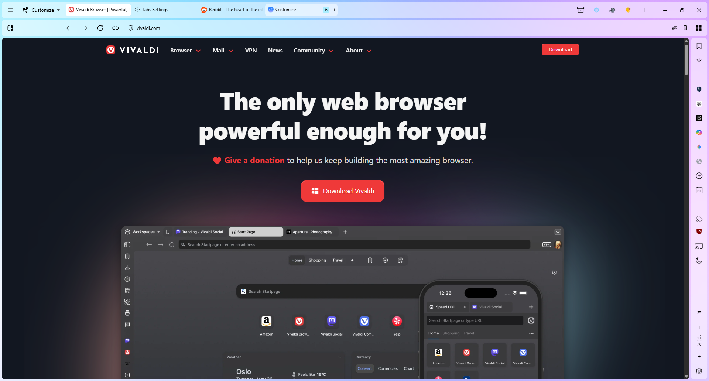
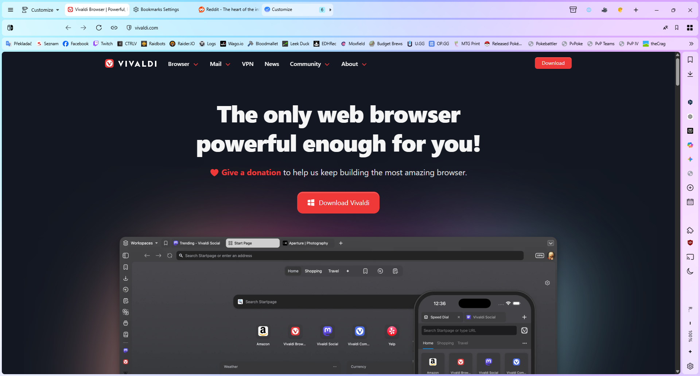
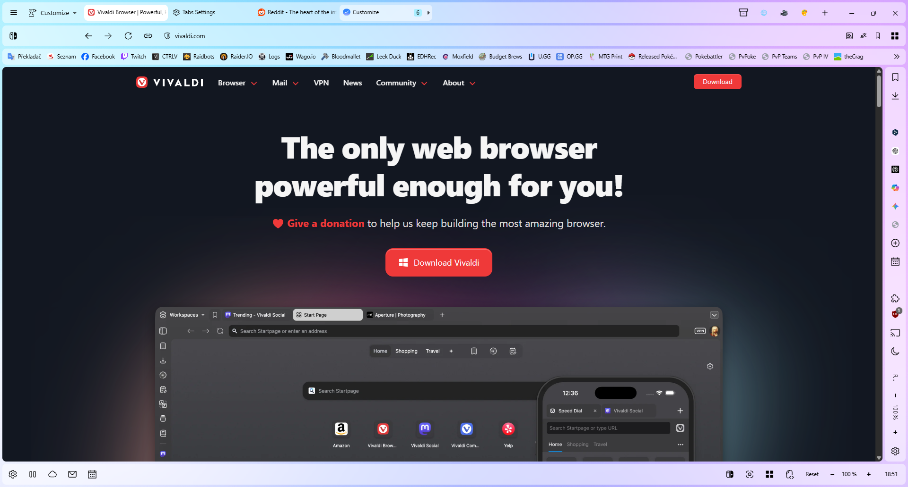
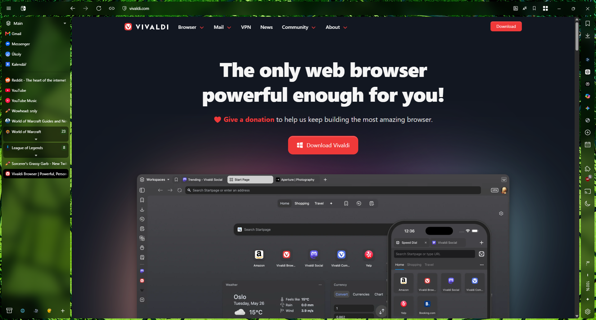
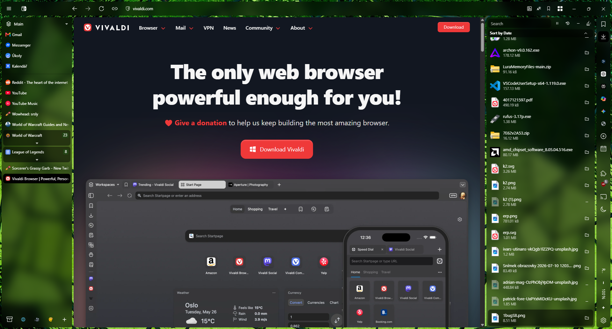
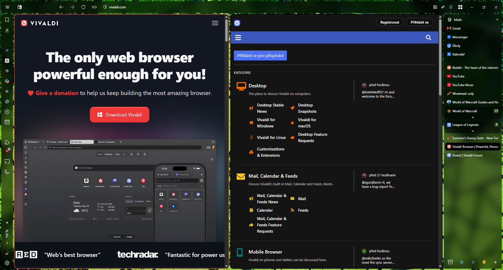
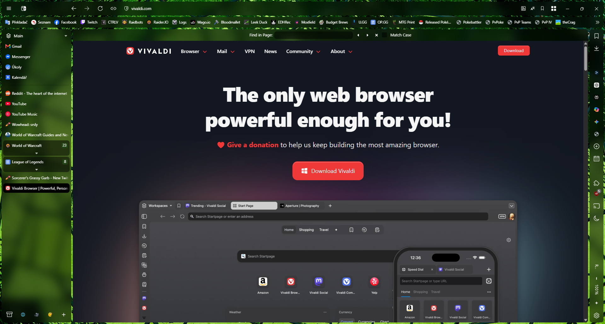

# Operaldi
My custom CSS for Vivaldi, inspired by Opera

Screenshots:

Configuration steps:

  1) Download the CSS file
  2) Type vivaldi://experiments in the URL bar and check Allow CSS modifications
  3) Open Vivaldi Settings
  4) Appearance > CUSTOM UI MODIFICATIONS and select the folder in which you downloaded the CSS.
  5) Appearance > User Interface Density > Regular
  6) Themes > New Theme... and follow the screenshots below:

  Colors:
  
 
  
  Background (my recommendations):
  
  https://abhishekkumarsahu.gumroad.com/l/driftwall (choose free version)
  
  [https://github.com/JustAdumbPrsn/Zen-Nebula/releases/tag/v3.1](https://github.com/JustAdumbPrsn/Zen-Nebula/releases/tag/v3.1)
  
  Settings:
  
  

  Icons (optional):

  You can replace the default icons with mine from this repository.
  
  7) Tabs > Tab Stacking > Accordion (only if you are using tab stacking)
  8) Tabs > WORKSPACES > check Enable Workspaces and Show Workspaces in Tab Bar
  9) Panel > Panel Options > check Floating Panel
  10) Rightclick tab stacking > Edit... > Choose "No color" to use design from CSS or any color if you want colorful tab stacking, repeat for every tab stacking (optional)
  11) Rightclick web app > Floating Panel > uncheck This panel, repeat for every web app you are using
  12) Rightclick tab bar > Customize Toolbar... > Move toolbar buttons according to screenshot (optional):

  

  13) Restart Vivaldi
  14) Enjoy your new CSS

My recommendations:

Command chains:

  1) Copy URL address with one button 

  

  2) Switch to workspace+change theme

  

  3) You can find more command chains guides here: https://forum.vivaldi.net/topic/63828/command-chain-recipes

Extension Arc Peek:

https://chromewebstore.google.com/detail/arc-peek-link-preview/cemmifilbjnnfldldefdakgljjloajhb
